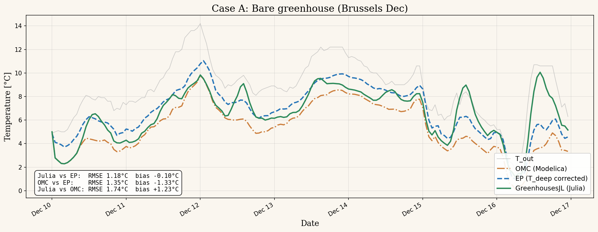

# Case A: Bare greenhouse, radiative subcooling (Brussels Dec)

## Scenario
- Julia scenario: `bare` from `scripts/benchmark.jl`
- EP IDF: `Greenhouses-Library-master/energyplus/greenhouse_bare.idf`
- Period: 7-day TMY starting 2024-12-10 (Brussels December)
- Julia T_deep: 10.68 °C (mean annual T_out, auto-computed)
- EP T_deep (original): 3.0 °C (constant all year, the known Modelica default)
- EP T_deep (corrected): 10.7 °C (matching Julia)

## Key finding
The original EP IDF used T_deep = 3°C, creating a cold soil sink that pulled the floor temperature down. This caused a +1.30°C bias (Julia warmer). Correcting T_deep to 10.7°C eliminates the bias.

## Metrics (Julia vs EP, T_air, hours 24-168)

| EP version | RMSE | Bias |
|---|---|---|
| Old (T_deep = 3°C) | 1.77 °C | +1.30 °C |
| **Corrected (T_deep = 10.7°C)** | **1.18 °C** | **-0.10 °C** |

## Energy balance explaining the ground term (one winter night)
- Q_sky (LW to cold sky): -28 W/m²
- Q_conv (cover to outside): -15 W/m²
- Q_ground (Julia, T_deep=10.7°C): -12 W/m² (ground HEATS the floor)
- Q_ground (EP old, T_deep=3°C): 0 W/m² (floor = T_deep, neutral)
- Delta Q = 12 W/m², estimated Delta T = 12/7 = 1.7°C, measured 1.30°C

## Plot


Green = Julia, blue dashed = EP corrected, red dotted = EP old (3°C ground).

## How to regenerate
```bash
# 1. Run Julia benchmark
cd /home/duchaufm/doctorat/fresh/GreenhousesJL && julia scripts/benchmark.jl

# 2. Run EP with corrected ground temp
python3 /tmp/rerun_ep_corrected.py

# 3. Generate comparison plots
python3 /tmp/plot_corrected.py
```
