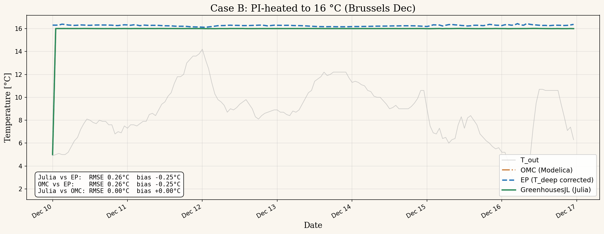

# Case B: PI-heated to 16 °C (Brussels Dec)

## Scenario
- Julia scenario: `heated` from `scripts/benchmark.jl`
- EP IDF: `/home/duchaufm/doctorat/fresh/Greenhouses-Library-master/energyplus/results_heated`
- Period: 7-day TMY starting 2024-12-10
- Julia data: `scripts/results_julia.csv` (169 hourly rows)
- EP data: ESO converted to hourly (168 hours)

## Metrics (Julia vs EnergyPlus, T_air)
| Metric | Value |
|---|---|
| RMSE | 0.28 °C |
| Bias | -0.28 °C |
| R² | -27.327 |
| Julia T_air range | [5.0, 16.0] °C |
| EP T_air range | [16.1, 16.4] °C |

## Plot


## How to regenerate
```bash
# 1. Run Julia benchmark (if results_julia.csv is stale)
cd /home/duchaufm/doctorat/fresh/GreenhousesJL && julia scripts/benchmark.jl

# 2. Regenerate plots
python3 /tmp/generate_comparison_plots.py
```
